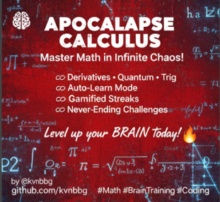

# ApocalypseCalculus

````markdown
# ApocalypseCalculus

(Axones) Brain Stimulator




**Apocalypse Calculus** is an infinite, gamified math and physics trainer designed as a **brain stimulator** (inspired by _Axones_—the ancient neural training grounds of the mind). Built for **agentic work**—empowering AI agents, developers, and autonomous systems to sharpen computational reasoning, pattern recognition, and adaptive learning—this web app turns mental math into an endless apocalypse of challenges. Survive waves of derivatives, quantum equations, and non-Euclidean geometry while leveling up your cognitive arsenal.

Whether you're an AI agent training for real-time decision-making, a developer prototyping agentic workflows, or a human user pushing mental limits, Apocalypse Calculus auto-adapts difficulty, provides hints, and teaches through failure. No boredom, just infinite progression.

🚀 **Live Demo**: [Deployed on GitHub Pages](https://kvnbbg.github.io/apocalypseCalculus) _(or host your own via the HTML file)_

## ✨ Features

- **Infinite Challenges**: Procedurally generated problems across math, physics, and beyond—basic arithmetic to advanced derivatives and quantum simulations. Difficulty scales every 10 solves.
- **Gamification & Progression**:
  - Score tracking, streak counters, and level-ups.
  - Progress bar for visual feedback.
  - Encouragement messages to keep momentum high (e.g., "You're a math wizard!").
- **Auto-Learning Mode**: 30-second idle timeout triggers auto-submit and correction—perfect for passive observation and learning without intervention.
- **Rich Math Rendering**: Powered by KaTeX for beautiful, professional display of equations (e.g., \\(\frac{d}{dx}(x^2) = 2x\\)).
- **Interactive Elements**:
  - Real-time input with hint button.
  - Smooth fade transitions and animations to prevent cognitive fatigue.
- **Agentic Integration**: Embeddable as a micro-app for AI workflows—expose challenges via API hooks (future extension) or run in iframes for autonomous training loops.
- **Themed UI/UX**: Dark, apocalyptic theme with glowing red accents for immersion. Responsive design for desktop/mobile.
- **Core Topics Covered**:
  - **Arithmetic**: Addition, subtraction, multiplication, division, percentages, negatives/positives.
  - **Advanced Math**: Powers, modulo, square roots, logarithms, exponentials, binary conversion, even/odd checks.
  - **Trigonometry**: Sin, cos, tan with variable angles.
  - **Geometry**: Euclidean distances, triangle/circle areas; intro to non-Euclidean (spherical excess).
  - **Calculus**: Polynomial derivatives with symbolic rendering.
  - **Physics**: Kinetic energy, free-fall distance.
  - **Quantum**: Hydrogen atom energy levels.
  - **And More**: Expandable via the operations array in `script.js`.

## 🛠️ Tech Stack

- **Frontend**: Vanilla HTML5, CSS3 (with animations/transitions), JavaScript (ES6+).
- **Math Rendering**: [KaTeX](https://katex.org/) for LaTeX-style equations.
- **Deployment**: Single-file HTML—host anywhere (GitHub Pages, Vercel, Netlify).
- **Optional Backend**: Lightweight PHP backend for server-side generation and Redis-backed storage.
- **Browser Support**: Modern browsers (Chrome, Firefox, Safari, Edge).

## 🚀 Quick Start

1. **Clone the Repo**:

   ```
   git clone https://github.com/kvnbbg/apocalypseCalculus.git
   cd apocalypseCalculus
   ```

2. **Run Locally**:

   - Open `public/index.php` directly in your browser (if using a PHP server) or serve static files.
   - Or serve with a local server:
     ```
     npx serve public  # or python -m http.server 8000 from public/
     ```

3. **Deploy**:

   - Push to GitHub and enable GitHub Pages for the static version.
   - Or deploy the `public/` folder to any PHP-capable host for server features.

4. **Customize for Agentic Work**:
   - Edit the `src/Operations.php` to add server-side operation rules.
   - Integrate with agents: Use `/index.php` API for headless operation generation.

## 📖 Usage Guide

### For Humans (Brain Training)

- Load the page and start solving challenges in the input field.
- Submit manually or let auto-mode teach you after 30s.
- Build streaks to unlock harder levels—aim for 100+!

### For AI Agents & Developers

- **Training Loop**: Fetch challenges from `/index.php` or use client-side `generateLocalOperation()` for headless runs.
- **Evaluation**: Compare agent outputs against `result` for reinforcement learning.
- **Example Agentic Snippet** (JavaScript):
  ```js
  // Pseudo-code for agent integration
  const payload = { action: "getOperation", level: 3 };
  const res = await fetch("/index.php", {
    method: "POST",
    headers: { "Content-Type": "application/json" },
    body: JSON.stringify(payload),
  });
  const challenge = await res.json();
  const agentGuess = yourAgent.solve(challenge.expr); // Your AI logic here
  const isCorrect = agentGuess === challenge.result;
  if (isCorrect) streak++;
  else learnFromMistake(challenge);
  ```

### Keyboard Shortcuts

- `Enter`: Submit answer.
- `H`: Toggle hint.

## PHP Server & Testing (local)

If you want the server-backed features (recommended), start the PHP built-in server from the repo root:

```bash
# serve public/ on port 8080
php -S 0.0.0.0:8080 -t public
```

API test examples:

```bash
# basic operation (level 1)
curl -X POST http://localhost:8080/index.php -H 'Content-Type: application/json' -d '{"action":"getOperation","level":1}'

# advanced operation (level 6)
curl -X POST http://localhost:8080/index.php -H 'Content-Type: application/json' -d '{"action":"getOperation","level":6}'

# extreme applied math (level 12)
curl -X POST http://localhost:8080/index.php -H 'Content-Type: application/json' -d '{"action":"getOperation","level":12}'
```

If the PHP server is not available, the frontend will fall back to local generation so you can still use the app.

## Use cases added in this update

- Server-side generation of operations with explicit `level` support.
- Client-side fallback when the backend is unreachable.
- Extreme difficulty (double-click "Hard" button) to request applied math / PDE-like problems.
- Resource link to Dartmouth applied math PDF for advanced study.

If you'd like, I can now:

1. Add PHPUnit tests for `src/Operations.php`.
2. Improve the extreme operation generator with more curated problems from the PDF.
3. Add a small CI workflow to run PHP lint and the tests on push.

## 🤝 Contributing

Contributions welcome! This is an open playground for math enthusiasts and agentic AI builders.

1. Fork the repo.
2. Create a feature branch (`git checkout -b feature/amazing-derivatives`).
3. Commit changes (`git commit -m 'Add quaternion ops for quantum agents'`).
4. Push (`git push origin feature/amazing-derivatives`).
5. Open a Pull Request.

**Ideas**:

- Add integrals or matrix ops.
- Integrate WebGL for visual physics sims.
- API endpoint for agentic batch challenges.

See [CONTRIBUTING.md](CONTRIBUTING.md) for details (create if needed).

## 📄 License

MIT License - Free to fork, modify, and deploy for your agentic empire. See [LICENSE](LICENSE) for details.

## 👋 Acknowledgments

- Built with ❤️ by [Kevin Marville](https://github.com/kvnbbg).
- Powered by KaTeX for math magic.
- Inspired by ancient _Axones_ and modern AI training paradigms.

**Connect**: [GitHub](https://github.com/kvnbbg) | [Instagram @techandstream](https://instagram.com/techandstream)

---

_Survive the math apocalypse. Level up your mind (or your agents). ∞_

---

_(This README is optimized for GitHub rendering—add badges, GIFs, or screenshots for extra flair!)_

## Issues

## Testing (PHP backend + API)

This project includes unit tests and API test scripts. They require PHP CLI and PHPUnit. On Debian/Ubuntu you can install PHP and PHPUnit with:

```bash
sudo apt update
sudo apt install php php-cli php-redis
# Install phpunit (global or project):
sudo apt install phpunit
```

Run PHPUnit tests:

```bash
# from repo root
vendor/bin/phpunit --bootstrap src/Operations.php tests/OperationsTest.php || phpunit --bootstrap src/Operations.php tests/OperationsTest.php
```

Start the PHP server and run API tests:

```bash
# start server
php -S 0.0.0.0:8080 -t public

# in another shell run API tests (requires jq installed)
./tests/api_test.sh
```

Frontend integration test (in-browser):

- Open the app at http://localhost:8080
- Open the browser console and run `app.testIntegration()` to call the server for levels 1,6,12 and observe the logs and any fallbacks.

If PHP is not available, the frontend will automatically fall back to local operation generation.

### Issue 1: [Bug] Derivative Generator Produces Invalid Polynomial Strings for Degree 0 Constants

**#1 opened on Oct 17, 2025 by kvnbbg**

**Description**:  
When generating derivatives for constant polynomials (e.g., \\( f(x) = 5 \\\)), the output string is '0' but the TeX rendering fails to wrap it properly, showing raw text instead of \\( 0 \\\). This breaks immersion in agentic training loops where symbolic output is parsed.

**Steps to Reproduce**:

1. Level up to trigger a high-degree poly that rolls a constant.
2. Observe `resultTex` in console: '0' without KaTeX delimiters.

**Expected Behavior**: Render as \\( 0 \\\).  
**Impact**: Low (rare), but affects symbolic AI integrations.  
**Priority**: Medium.  
**Labels**: bug, calculus, rendering.

### Issue 2: [Enhancement] Add Integral Operations for Balanced Calculus Coverage

**#2 opened on Oct 17, 2025 by kvnbbg**

**Description**:  
Derivatives are covered, but no antiderivatives/integrals. For agentic work in optimization (e.g., RL reward integrals), add basic indefinite integrals for polynomials and trig functions.

**Proposed Solution**:

- Extend `operations` array with an integral generator using SymPy.js or manual rules.
- Example: \\(\\int x^2 dx = \\frac{x^3}{3} + C\\) .

**Benefits**: Completes calculus suite; useful for physics sim agents.  
**Difficulty**: Medium (symbolic math).  
**Priority**: High.  
**Labels**: enhancement, calculus, agentic.

### Issue 3: [Feature] Expose RESTful API for Headless Agentic Integration

**#3 opened on Oct 17, 2025 by kvnbbg**

**Description**:  
Current app is UI-only; for true agentic workflows (e.g., LangChain agents or autonomous bots), provide a simple API to fetch challenges/results without browser.

**Proposed Solution**:

- Add `api.js` with endpoints like `/challenge?level=5&topic=quantum`.
- Use Express.js mini-server (or serverless via Vercel).
- Auth via API key for rate-limiting.

**Use Case**: Integrate into AI pipelines for dynamic math-based decision trees.  
**Difficulty**: High (new backend).  
**Priority**: High.  
**Labels**: feature, api, agentic.
````
